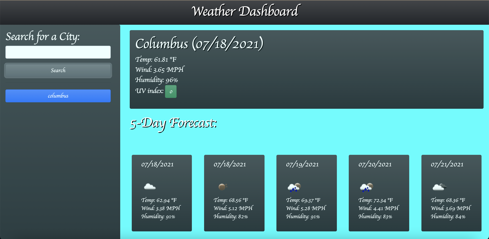

# Weather-Dashboard-App-Project
* This project's main purpose is to build a weather dashboard app that will run in the browser and feature dynamically updated HTML and CSS.
* This Project uses the OpenWeather One Call API https://openweathermap.org/api/one-call-api to retrieve weather data for cities which is done by making requests with specific parameters. 
* This Project uses LocalStorate to store all the visited cities reasearched within the page. 
#
# The Project Deliverables: 

* Thru this weather dashboard app, the user is able view the weather outlook for multiple or desired cities which allows the user to plan a trip to those cities accordingly.
* Once the city is inputed in the search bar, the user is presented with current and future conditions for that searched city that is added to the search history
#
# The Deployed Weather Dashboard App screenshot
The following image shows the weather dashboard appearance and functionality:

#
# The URL of the Deplyed app or Project
* https://lbladma.github.io/Weather-Dashboard-App/

#
# The URL of the GitHub repository for the Project.
* https://github.com/lbladma/Weather-Dashboard-App